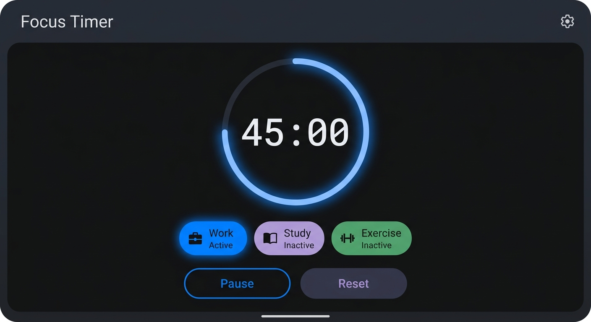
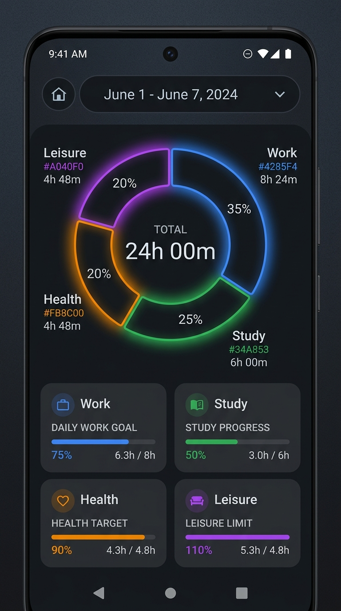
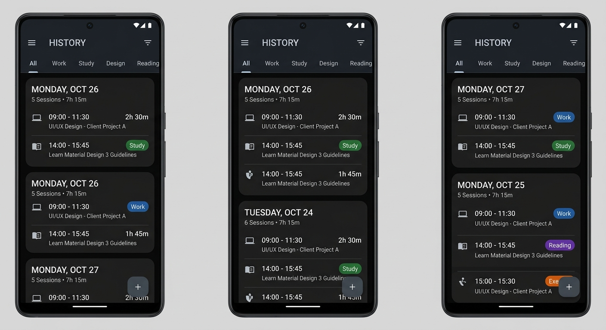

# Timebit (每日记录) ⌛

[](https://kotlinlang.org/)
[](https://developer.android.com/jetpack/compose)
[](https://developer.android.com/training/data-storage/room)
[](https://developer.android.com/studio)

**Timebit**（每日记录）是一款优雅、现代、高度轻量化的个人时间记录与分析应用。它遵循最新的 **Material Design 3 (M3)** 设计规范，完全基于 Jetpack Compose 与 Room 本地数据库，以最纯净的设计和绝对的数据安全保障，帮助您建立起对时间流逝的精细化自我感知。

## 📸 运行截图 (App Screenshots)

<p align="center">
  
  
  
</p>

---

## 🎨 视觉与体验亮点 (Design & Experience Highlights)

### 🌿 极简美学设计
- **圆角卡片聚合**：在历史记录页，改变了传统的零散卡片流带来的松散感。今日产生的多条专注纪录会**自动聚合成一张扁平化的精致物理卡片**，利用柔和的单层透明分割线（`HorizontalDivider` 0.4 Alpha）进行隐式区块划分，极大地增加了单屏阅读容积。
- **无背景微观图表**：统计页面在展示月度各分类目标的进度条、数值时，移除了不必要的底框和有色背景色块。进度线条与文字指标构成流畅的排版节奏，轻量且高级。
- **自适应暗色/亮色模式**：遵循 Material 3 的动态上色（Dynamic Color）系统。自适应高对比色值，提供极佳的护眼阅读体验。

### ⚙️ 精细化人机交互 (Ergonomic UX)
- **多语言（中/英）无缝适配**：全方位的多语言支持！无论是在主页计时、历史详情还是通知栏中，均根据系统语言自动切换界面文本。分类选项、空提示文字（以 “该天暂无专注记录 / No logs for this day” 替代）、编辑/保存交互状态、甚至是默认的 “快捷计时 (Quick Timer)” 缺省值均完美本土化。
- **设定页智能排布**：为了防止文本换行影响美学排版，“自动计时启动时间”的文本框宽度优化为自适应黄金长宽比（`180.dp` 宽级），既保证文字不换行，又为右侧的**单行水平滚动（Horizontal Scroll）快捷时间预设面板**留出了舒适空间（内置 "08:00", "09:00", "18:00", "19:00" 一键直达芯片）。
- **生命周期回切检查 (Lifecycle-Aware Check)**：支持生命周期监听。当用户从其他外部应用切回“计时”主页，应用立刻主动触发自动计时时间比对并实时同步，不放过任何后台事件刷新点。

---

## 🚀 核心功能架构 (Core Functional Map)

```
        ┌─────────────────────────────────────────────────────────┐
        │                        Timebit                          │
        └────────────────────────────┬────────────────────────────┘
                                     │
           ┌─────────────────────────┼─────────────────────────┐
           ▼                         ▼                         ▼
  「计时追踪器」               「明细归档」                「深度透视」
  - 动态分类实时计时            - 按天聚合卡片流           - 分类进度数据透视表
  - 当月完成率统计              - 快速项单项编辑           - 历史图表比照
  - 下手起步100%封顶            - 极简扁平标签             - floor 核心进度还原
```

### 1. 计时页 (Timer Screen)
- **实时控制**：主显核心时钟以优雅数字跳动渲染耗时。时间下方的分类文本支持随系统语言动态渲染。
- **高精度目标完成比**：
  - 进度逻辑深度闭环，百分比计算采用**向下取整（`floor`）**算法，督促用户脚踏实地。
  - 单分类月度任务进度最高 **100% 封顶**，即使单月超额完成依旧保持 100% 满格成就感。

### 2. 补录与编辑 (Manual Logs & Dialogue Modals)
- **单项零死角编辑**：在列表点击即可快速弹出精美弹窗，允许自定义备注标签、所属分类、以及快速增减时长（以分钟为步长安全增减）。
- **防内存泄露的安全弹窗**：所有的确认框、删除警示框（DeleteConfirmationDialog）和编辑浮窗均通过 Kotlin 安全的可空变量解构（`.let { ... }` 作用域函数）进行渲染周期管理，从根本上杜绝了因数据指针悬空导致的设备崩溃（`InputDispatcher channel broken`）。

### 3. 数据安全防篡改变验系统 (Data Safety Engine)
在支持本地备份和恢复（Settings中）的基础上，应用引进了**强加密完整性校验**：
- **安全哈希校验**：导出的 `.json` 备份携带了基于应用级安全盐值（`TimeTrackAppSafeBackupSalt_2026`）通过 **SHA-256** 算法级联哈希得到的校验和 (`checksum`)。
- **防修改污染**：每次导入时由于算法级比对，若任何一个字符（分类、时长、或时间戳）被非法篡改过，反序列化引擎将立即阻断写入并在界面予以阻尼警告，100% 保证个人隐私历史的精确度。

---

## 🏗️ 架构与技术栈说明 (Technical Architecture)

本款应用是一个 100% 单应用、纯本地、离线优先（Offline-First）的现代 Kotlin 移动工程。

### 技术选型与依赖
*   **Kotlin 1.9** + **Coroutines** 异步并发架构。
*   **Compose BOM** / **Material Design 3 (M3)**：提供一致、流畅流畅的 UI 交互组件（Scaffold、IconButton、Filled TextField 等）。
*   **ViewModel + StateFlow + LifecycleCompose**：响应式状态机及状态自观测系统，保持数据源（Single Source of Truth）在全局界面中秒级同步。
*   **Room Engine (Local SQLite)**：高性能轻量化 ORM。提供结构化的安全数据，索引高效，持久存储，零性能损耗。

### 数据表（Entity）核心定义

```kotlin
@Entity(tableName = "time_logs")
data class TimeLog(
    @PrimaryKey(autoGenerate = true) val id: Int = 0,
    val category: String,             // 关联时间分类 (e.g. "学习", "工作", "生活")
    val description: String,          // 每条记录描述（未填则自动本地化补充 "Quick Timer" / "快捷计时"）
    val startTime: Long,              // 毫秒级 unix 时间戳 (UTC/Local)
    val durationMinutes: Long,        // 累计专注时间（分钟数）
    val endTime: Long = 0L,           // 截至毫秒级时间戳
    val updatedTime: Long,            // 写入更新时间戳
    val belongDate: String            // 所属日期标识 yyyy-MM-dd (便于聚合检索)
)
```

---

## 🛠️ 构建与开发指南 (Build & Contribution Guide)

如果您希望进一步扩展 Timebit，可直接使用标准的 Android 开发工具链进行本地构建。关于具体的业务逻辑、架构设计和数据库系统设计的详细信息，请参阅新版开发者文档：[**docs/DOCUMENTATION.md**](docs/DOCUMENTATION.md)。

### 项目目录结构
```text
.
├── app
│   ├── src/main
│   │   ├── java/com/example
│   │   │   ├── MainActivity.kt        # 应用入口 Activity
│   │   │   ├── DatabaseProvider.kt    # Room 数据库初始化供应器
│   │   │   ├── data                   # 持久化数据层 Room Entity & Dao
│   │   │   └── ui                     # 表现层 (Composable 布局、Theme 及组件等)
│   │   └── res/values                 # 本地化字符串与图标定义列表 (zh, en)
│   └── build.gradle.kts               # 应用级构建配置及依赖项清单
└── build.gradle.kts                   # 根级构建定义
```

### 命令速查
1. **构建安装包**:
   ```bash
   gradle assembleDebug
   ```
2. **运行单元测试**:
   ```bash
   gradle :app:testDebugUnitTest
   ```
3. **语法及规范审查 (Lint)**:
   ```bash
   gradle :app:lintDebug
   ```

---

## 🔒 隐私与许可证明
Timebit 是一款开源且离线的极客计时利器。您存储在 app 内的全部专注数据完全归您个人所有，数据储存在您的沙盒包体内，未经授权不会传输、同步至任何未知第三方网络或云端。

让我们一同专注当下的每一秒钟！🍃
